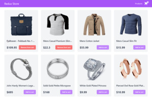

<!-- WELCOME -->
 

<h2 align="center">React Redux Shopping Cart</h2>

  
  

    <a href="https://mbalinoftw-react-redux-shopping-cart.netlify.app/">View Demo</a>
  

<!-- ABOUT THE PROJECT -->

## Description

This is a React Shopping Cart project using Redux Toolkit for state management.\
The list of products are fetched from [Fake Store API](https://fakestoreapi.com/).

## Built With

- [React](https://reactjs.org/)
- [Redux Toolkit](https://redux-toolkit.js.org/)
- [Tailwind CSS](https://tailwindcss.com/)
- [React Router Dom](https://reactrouter.com/en/main)
- [Axios](https://axios-http.com/docs/intro)
- [Toastify](https://fkhadra.github.io/react-toastify/introduction)
- [HeroIcons](https://heroicons.com/)
